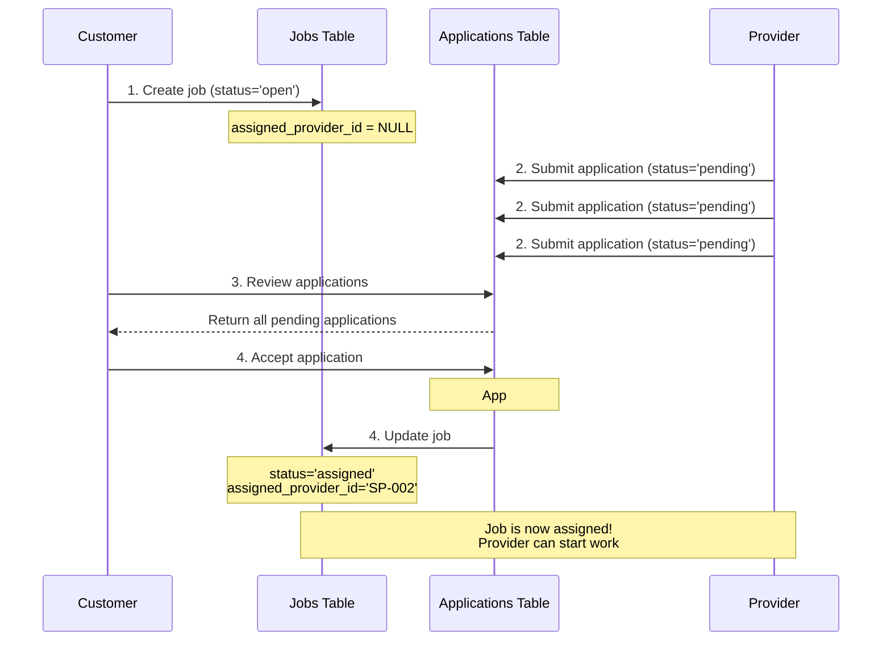

# Job Application Workflow Explanation

## Database Schema Overview

### Two Main Tables

#### 1. **`jobs` Table** (The main job record)
```sql
CREATE TABLE IF NOT EXISTS jobs (
    job_id BIGINT AUTO_INCREMENT PRIMARY KEY,
    customer_id BIGINT NOT NULL,
    title VARCHAR(255) NOT NULL,
    description TEXT NOT NULL,
    category VARCHAR(100) NULL,
    location_address VARCHAR(500) NOT NULL,
    -- ... other fields ...
    status ENUM('open', 'assigned', 'in_progress', 'completed', 'cancelled') 
           NOT NULL DEFAULT 'open',
    assigned_provider_id VARCHAR(40) NULL,  -- ⭐ This links to the chosen provider
    created_at TIMESTAMP DEFAULT CURRENT_TIMESTAMP,
    updated_at TIMESTAMP DEFAULT CURRENT_TIMESTAMP ON UPDATE CURRENT_TIMESTAMP
);
```

**Key Fields:**
- `status`: Tracks the job lifecycle
  - `open` - Job is posted, waiting for applications
  - `assigned` - Customer accepted an application, provider assigned
  - `in_progress` - Work has started
  - `completed` - Work is done
  - `cancelled` - Job was cancelled
- `assigned_provider_id`: NULL when open, set to provider_id when assigned

#### 2. **`job_applications` Table** (Provider applications)
```sql
CREATE TABLE IF NOT EXISTS job_applications (
    application_id BIGINT AUTO_INCREMENT PRIMARY KEY,
    job_id BIGINT NOT NULL,                    -- Links to jobs table
    provider_id VARCHAR(40) NOT NULL,
    proposed_price DECIMAL(10, 2) NULL,
    message TEXT NULL,
    status ENUM('pending', 'accepted', 'rejected') NOT NULL DEFAULT 'pending',
    created_at TIMESTAMP DEFAULT CURRENT_TIMESTAMP,
    UNIQUE KEY unique_application (job_id, provider_id)  -- One app per provider per job
);
```

**Key Fields:**
- `status`: Application status
  - `pending` - Waiting for customer decision
  - `accepted` - Customer chose this provider
  - `rejected` - Customer declined or chose another provider
- `job_id`: Foreign key linking to the job

---

## 🔄 Complete Workflow

### Step 1: Customer Posts a Job
**Action**: Customer creates a new job

**Database Changes**:
```sql
INSERT INTO jobs (
    customer_id, title, description, category, 
    location_address, budget_min, budget_max, status
) VALUES (
    1, 'Fix leaking kitchen sink', 'Urgent plumbing repair needed', 'Plumbing',
    '123 Main St, Toronto', 100.00, 200.00, 'open'
);
```

**Result**:
- New job created with `status = 'open'`
- `assigned_provider_id = NULL`
- Job is now visible to service providers

---

### Step 2: Service Providers Apply
**Action**: Multiple providers submit applications

**Database Changes**:
```sql
-- Provider 1 applies
INSERT INTO job_applications (job_id, provider_id, proposed_price, message, status)
VALUES (1, 'SP-001', 150.00, 'I have 10 years of plumbing experience...', 'pending');

-- Provider 2 applies
INSERT INTO job_applications (job_id, provider_id, proposed_price, message, status)
VALUES (1, 'SP-002', 125.00, 'I can start immediately...', 'pending');

-- Provider 3 applies
INSERT INTO job_applications (job_id, provider_id, proposed_price, message, status)
VALUES (1, 'SP-003', 175.00, 'Licensed master plumber...', 'pending');
```

**Result**:
- Multiple applications with `status = 'pending'`
- Job still has `status = 'open'`
- Customer can now review all applications

---

### Step 3: Customer Reviews Applications
**Action**: Customer views all applications for their job

**API Call**: `GET /jobs/1/applications`

**Response**:
```json
{
  "job_id": 1,
  "application_count": 3,
  "applications": [
    {
      "application_id": 1,
      "provider": {
        "provider_id": "SP-001",
        "name": "John Carter",
        "rating": 4.8
      },
      "proposed_price": 150.00,
      "message": "I have 10 years...",
      "status": "pending"
    },
    // ... more applications
  ]
}
```

---

### Step 4: Customer Accepts an Application ⭐
**Action**: Customer chooses Provider SP-002

**API Call**: `PUT /job/1/applications/2` with `{"action": "accept"}`

**Database Changes** (Transaction):
```sql
-- 1. Update the accepted application
UPDATE job_applications 
SET status = 'accepted' 
WHERE application_id = 2;

-- 2. Update the job - THIS IS KEY! ⭐
UPDATE jobs 
SET status = 'assigned', 
    assigned_provider_id = 'SP-002'
WHERE job_id = 1;

-- 3. Reject all other pending applications
UPDATE job_applications 
SET status = 'rejected' 
WHERE job_id = 1 
  AND application_id != 2 
  AND status = 'pending';
```

**Result**:
- ✅ Application #2: `status = 'accepted'`
- ❌ Applications #1, #3: `status = 'rejected'`
- ✅ Job: `status = 'assigned'`, `assigned_provider_id = 'SP-002'`

---

### Step 5: Job Becomes an Active Assignment
**Current State**:

**jobs table**:
```
job_id | customer_id | title              | status    | assigned_provider_id
-------|-------------|--------------------|-----------|-----------------------
1      | 1           | Fix leaking sink   | assigned  | SP-002
```

**job_applications table**:
```
application_id | job_id | provider_id | status
---------------|--------|-------------|----------
1              | 1      | SP-001      | rejected
2              | 1      | SP-002      | accepted  ⭐
3              | 1      | SP-003      | rejected
```

> [!IMPORTANT]
> **The job does NOT move to a different table!** It stays in the `jobs` table but changes status from `'open'` to `'assigned'`.

---

## 📊 Visual Workflow Diagram



---

## 🔄 Status Transitions

### Job Status Flow
```
open → assigned → in_progress → completed
  ↓
cancelled
```

### Application Status Flow
```
pending → accepted (only ONE per job)
pending → rejected (all others)
```

---

## Key Relationships

### How They Connect

1. **One Job → Many Applications**
   - A job can have multiple applications
   - Each application links to the job via `job_id`

2. **One Application → One Job**
   - Each application is for exactly one job
   - Foreign key: `job_applications.job_id → jobs.job_id`

3. **One Job → One Assigned Provider** (after acceptance)
   - When application is accepted, job gets `assigned_provider_id`
   - This creates the "active job" relationship

---

## 💡 Important Clarifications

### ❌ Common Misconception
> "When customer accepts, the job moves to a different table"

### ✅ Actual Behavior
> "The job **stays in the same table** but its status changes from `'open'` to `'assigned'` and it gets an `assigned_provider_id`"

### Why This Design?

1. **Single Source of Truth**: All jobs (open, assigned, completed) are in one table
2. **Easy Tracking**: Can query job history by status
3. **Referential Integrity**: Applications always link to the same job record
4. **Audit Trail**: Can see the full lifecycle of a job

---

## 📋 Example Queries

### Get all open jobs (available for applications)
```sql
SELECT * FROM jobs 
WHERE status = 'open';
```

### Get all assigned jobs for a provider
```sql
SELECT * FROM jobs 
WHERE assigned_provider_id = 'SP-002' 
  AND status IN ('assigned', 'in_progress');
```

### Get accepted application for a job
```sql
SELECT ja.*, sp.name, sp.phone
FROM job_applications ja
JOIN service_providers sp ON ja.provider_id = sp.provider_id
WHERE ja.job_id = 1 
  AND ja.status = 'accepted';
```

### Get all jobs a provider has applied to
```sql
SELECT j.*, ja.status as application_status, ja.proposed_price
FROM jobs j
JOIN job_applications ja ON j.job_id = ja.job_id
WHERE ja.provider_id = 'SP-002';
```

---

## 🎯 Summary

**The Complete Flow:**

1. **Customer posts job** → `jobs` table with `status='open'`
2. **Providers apply** → `job_applications` table with `status='pending'`
3. **Customer accepts** → 
   - Application: `status='accepted'`
   - Job: `status='assigned'` + `assigned_provider_id` set
   - Other applications: `status='rejected'`
4. **Job is now assigned** → Provider can start work
5. **Provider works** → Job `status='in_progress'`
6. **Work completes** → Job `status='completed'`

**The job never "moves" - it just changes status within the same `jobs` table!**
